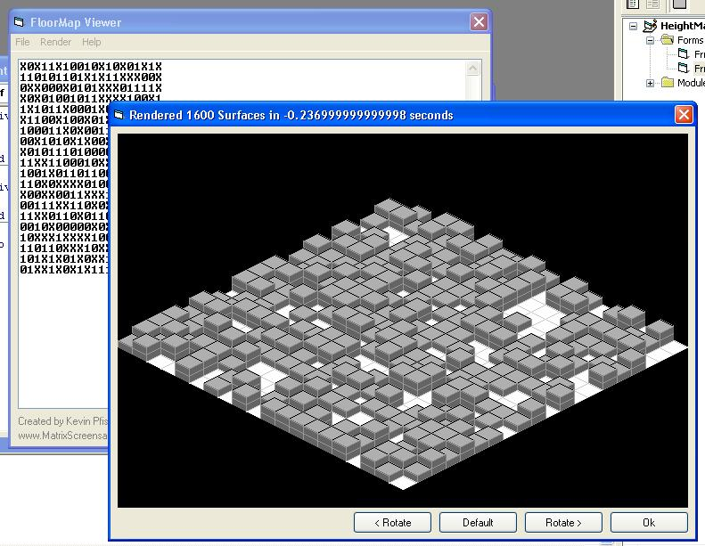



## Isometric 3d Heightmap renderer

### Description

Using this program you can get heightmaps like those in Habbo.com or others, or make your own and then it will display a 3d Isometric Render of it, which can be rotated
 
### More Info
 

             |
---                |---
**Submitted On**   |2003-09-21 13:22:28
**By**             |[Kevin Pfister](https://github.com/Planet-Source-Code/PSCIndex/blob/master/ByAuthor/kevin-pfister.md)
**Level**          |Intermediate
**User Rating**    |5.0 (45 globes from 9 users)
**Compatibility**  |VB 5\.0, VB 6\.0
**Category**       |[Graphics](https://github.com/Planet-Source-Code/PSCIndex/blob/master/ByCategory/graphics__1-46.md)
**World**          |[Visual Basic](https://github.com/Planet-Source-Code/PSCIndex/blob/master/ByWorld/visual-basic.md)
**Archive File**   |[Isometric\_1648689222003\.zip](https://github.com/Planet-Source-Code/kevin-pfister-isometric-3d-heightmap-renderer__1-48700/archive/master.zip)

